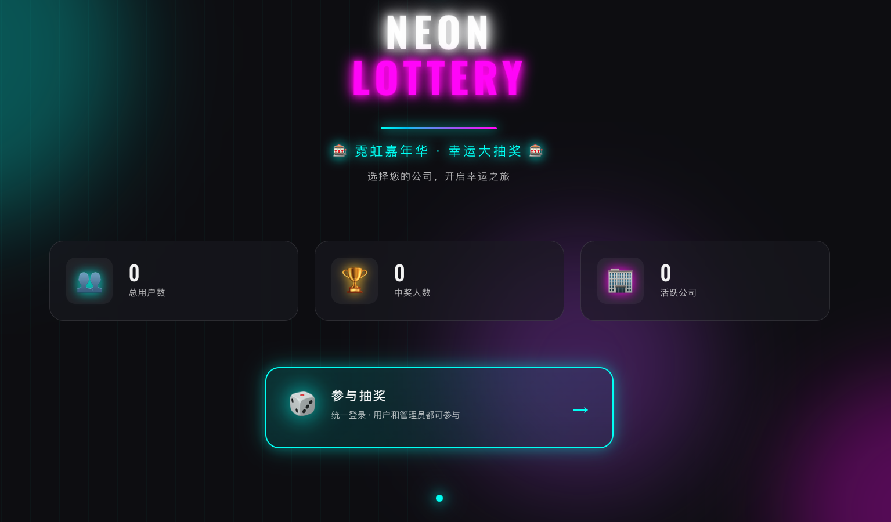
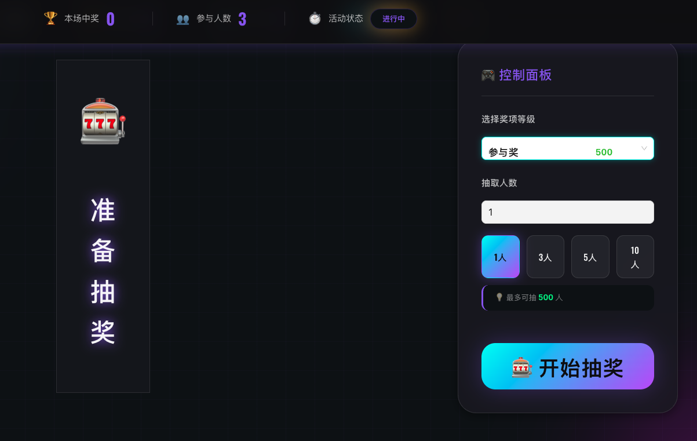
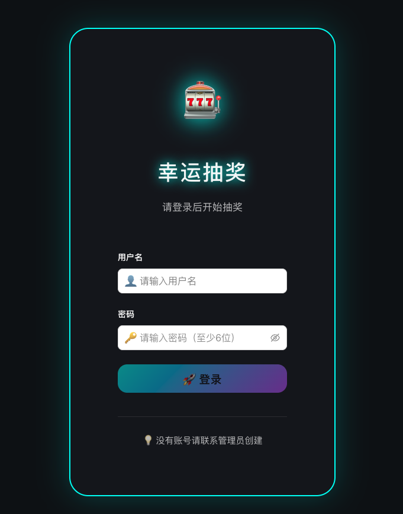
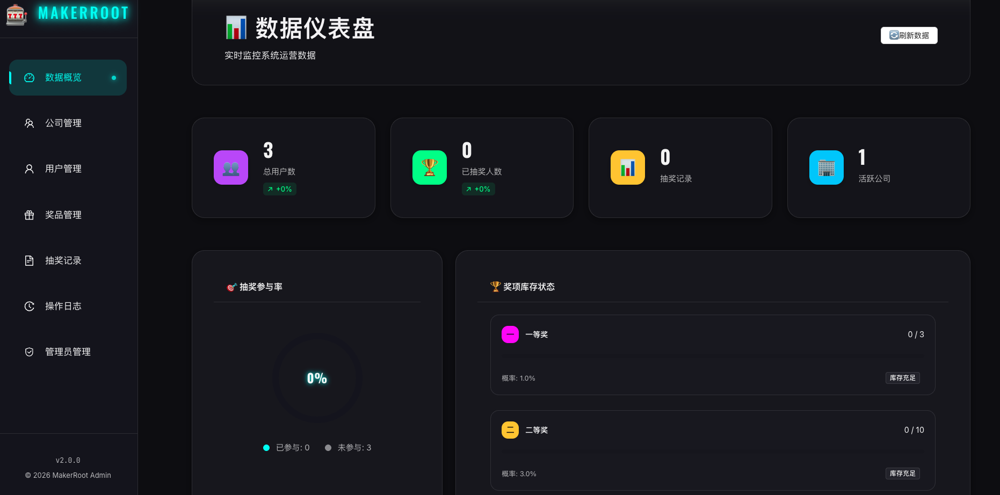

# 🎉 幸运大抽奖系统

一个完整的企业级抽奖系统，支持大屏抽奖动画、管理后台、数据统计等功能。**使用Docker Compose一键部署，3分钟即可上线！**

## 🌐 在线体验

**系统地址**: http://makerroot.com

**管理后台**: http://makerroot.com/#/admin/

**默认管理员账号**:
- 用户名: `makerroot`
- 密码: `123456`

## 🎨 界面预览

### 用户端 - 抽奖首页

### 用户端 - 中奖页面


### 管理后台 - 登录页面


### 管理后台 - 数据概览


## ✨ 功能特性

### 🎰 用户端
- 大屏滚动抽奖动画效果
- 🎁 实时显示奖项信息
- ✨ 精美的中奖动画展示
- 🔒 每人只能抽一次奖
- 📝 简单的参与流程

### 🔐 管理后台
- JWT认证登录
- 📊 数据概览统计
- 🎁 奖项等级管理（CRUD）
- 📈 库存管理
- 📋 抽奖记录查询（支持搜索和分页）
- 👥 用户管理

## 🛠️ 技术栈

### 后端
- **语言**: Golang 1.18+
- **框架**: Gin Web Framework
- **数据库**: MySQL 8.0
- **缓存**: Redis 7
- **ORM**: GORM
- **认证**: JWT
- **架构**: 三层架构（Handler → Service → Repository）

### 前端
- **框架**: Vue 3 + Composition API
- **构建工具**: Vite
- **UI组件**: Ant Design Vue
- **HTTP客户端**: Axios
- **路由**: Vue Router

### 部署
- **容器化**: Docker + Docker Compose
- **反向代理**: Caddy 2（自动HTTPS）
- **证书**: Let's Encrypt
- **一键部署**: Docker Compose 部署脚本

## 🚀 快速部署（推荐）

### 方式一：Docker Compose 一键部署（生产环境）

⚡ **3分钟完成部署！**

```bash
# 1. 克隆项目
git clone <repository>
cd lottery-system

# 2. 修改配置（首次使用）
vim docker-compose-production.env
```

**必须修改以下配置**：
```env
MYSQL_ROOT_PASSWORD=your_strong_password_here
MYSQL_PASSWORD=your_strong_password_here
REDIS_PASSWORD=your_strong_password_here
JWT_SECRET=your-super-secret-jwt-key-at-least-32-characters-long
```

```bash
# 3. 启动服务
docker compose --env-file docker-compose-production.env up -d

# ✅ 完成！访问以下地址：
# 前端: https://localhost
# 管理后台: https://localhost/admin
# API: https://localhost/api/*
```

**首次启动自动初始化**：
- ✅ 创建数据库和表
- ✅ 创建默认管理员
- ✅ 创建默认公司
- ✅ 创建5个奖品等级
- ✅ 创建5个默认奖品

### 启动的服务

Docker Compose模式会自动启动以下服务：

1. ✅ **MySQL 8.0** - 数据库（端口3306，内部访问）
2. ✅ **Redis 7** - 缓存（端口6379，内部访问）
3. ✅ **Go Backend** - API服务（内部端口8080）
4. ✅ **Vue Frontend** - 前端界面（内部端口80）
5. ✅ **Caddy** - 反向代理 + HTTPS（端口80/443）

所有服务通过Docker网络隔离，仅Caddy对外暴露端口，更加安全！

### 方式二：HTTPS部署（已有证书）

如果已有Let's Encrypt证书，使用HTTPS部署脚本：

```bash
# 使用HTTPS部署脚本
./deploy-https.sh
```

### 方式三：本地开发模式

```bash
# 后端开发
cd backend
go run main.go

# 前端开发
cd frontend
npm run dev

# 后端会运行在 http://localhost:8080
# 前端会运行在 http://localhost:3000
```

## 📦 项目结构

```
lottery-system/
├── backend/                 # Go 后端服务
│   ├── config/             # 配置管理
│   ├── models/             # 数据模型
│   ├── handlers/           # HTTP处理器
│   ├── services/           # 业务逻辑层
│   ├── repositories/       # 数据访问层
│   ├── middleware/         # 中间件（JWT、CORS等）
│   ├── utils/              # 工具函数
│   ├── validators/         # 数据验证
│   ├── main.go             # 入口文件
│   ├── Dockerfile          # Docker构建文件
│   └── init_prize_levels.go # 奖项初始化脚本
│
├── frontend/               # Vue 3 前端（统一）
│   ├── src/
│   │   ├── views/         # 页面组件
│   │   │   ├── Home.vue           # 首页
│   │   │   ├── Lottery.vue        # 用户抽奖页面
│   │   │   └── admin/             # 管理后台
│   │   ├── router/        # 路由配置
│   │   ├── utils/         # 工具函数
│   │   ├── App.vue        # 主应用组件
│   │   └── main.js        # 入口文件
│   ├── Dockerfile         # Docker构建文件
│   └── package.json
│
├── docker/                 # Docker配置
│   ├── mysql/
│   │   ├── data/          # MySQL数据（自动创建）
│   │   ├── conf.d/        # MySQL配置
│   │   └── init/          # 初始化SQL脚本
│   ├── redis/
│   │   ├── data/          # Redis数据（自动创建）
│   │   └── redis.conf     # Redis配置
│   └── caddy/
│       ├── Caddyfile      # Caddy配置
│       ├── data/          # Caddy数据（自动创建）
│       └── logs/          # Caddy日志（自动创建）
│
├── docker-compose.yml                    # Docker Compose配置
├── docker-compose-production.env         # 生产环境变量
├── deploy-https.sh           # HTTPS部署脚本（使用已有证书）
├── deploy-production.sh       # 生产环境部署脚本
├── .gitignore               # Git忽略配置
├── .dockerignore            # Docker忽略配置
└── README.md                # 本文档
```

## 📱 使用说明

### 用户抽奖流程

1. 打开用户端页面 `https://localhost`
2. 输入参与信息（如姓名）
3. 查看奖项设置和库存
4. 点击"点击抽奖"按钮
5. 观看滚动抽奖动画
6. 查看中奖结果

### 管理后台使用

3. 在"数据概览"查看统计数据
4. 在"奖品管理"中添加/编辑奖项等级
5. 在"抽奖记录"中查看所有抽奖记录
6. 在"用户管理"中查看注册用户

## 🎯 核心功能说明

### 抽奖算法

系统使用**加权随机算法**：
- 每个奖项设置不同的中奖概率
- 概率总和可以小于1（未中奖概率）
- 库存管理：当某奖项库存为0时，不会再抽中该奖项
- 每人只能抽一次奖

### 自动初始化数据

首次启动时，系统会自动初始化以下数据：

1. ✅ **默认超级管理员**
   - 用户名: makerroot
   - 密码: 123456

2. ✅ **默认公司**
   - 名称: 默认公司
   - 代码: DEFAULT

3. ✅ **默认奖品等级**（5个）
   - 一等奖: iPhone 15 Pro（概率1%，库存3个）
   - 二等奖: iPad Pro（概率3%，库存10个）
   - 三等奖: AirPods Pro（概率10%，库存30个）
   - 四等奖: 小米充电宝（概率20%，库存100个）
   - 参与奖: 定制纪念品（概率40%，库存500个）

4. ✅ **默认奖品**（5个）
   - 每个奖品等级对应1个默认奖品

**无需手动操作，开箱即用！**

## 🔐 环境配置说明

### docker-compose-production.env

生产环境配置文件（**必须修改密码**）：

```env
# ============================================
# 数据库配置
# ============================================
MYSQL_ROOT_PASSWORD=your_strong_password_here
MYSQL_DATABASE=lottery_db
MYSQL_USER=lottery_user
MYSQL_PASSWORD=your_strong_password_here

# ============================================
# Redis配置
# ============================================
REDIS_PASSWORD=your_strong_password_here

# ============================================
# JWT密钥（至少32字符）
# ============================================
JWT_SECRET=your-super-secret-jwt-key-at-least-32-characters-long

# ============================================
# 服务器配置
# ============================================
SERVER_PORT=8080
GIN_MODE=release

# ============================================
# CORS配置（允许的前端域名）
# ============================================
ALLOWED_ORIGINS=https://localhost,https://your-production-domain.com

# ============================================
# 数据持久化目录（可选，默认使用./docker/*）
# ============================================
MYSQL_DATA_DIR=./docker/mysql/data
REDIS_DATA_DIR=./docker/redis/data
CADDY_DATA_DIR=./docker/caddy/data
CADDY_LOGS_DIR=./docker/caddy/logs
BACKEND_LOGS_DIR=./docker/backend/logs
```

## 🔧 HTTPS配置

系统使用Caddy自动配置HTTPS，支持两种模式：

### 1. Let's Encrypt证书（生产环境）

修改 `docker/caddy/Caddyfile`：

### 2. 已有证书（本地开发）

已配置为使用 `/etc/letsencrypt` 目录下的证书：

```caddy
makerroot.com {
    tls /etc/letsencrypt/live/makerroot.com/fullchain.pem \
        /etc/letsencrypt/live/makerroot.com/privkey.pem

    # ... 其他配置
}
```

## 📊 服务管理

### 查看服务状态

```bash
# 查看服务状态
docker compose --env-file docker-compose-production.env ps

# 查看详细日志
docker compose --env-file docker-compose-production.env logs -f

# 查看特定服务日志
docker compose --env-file docker-compose-production.env logs -f backend
docker compose --env-file docker-compose-production.env logs -f mysql
```

### 停止服务

```bash
# 停止所有服务
docker compose --env-file docker-compose-production.env down
```

### 重启服务

```bash
# 重启所有服务
docker compose --env-file docker-compose-production.env restart

# 重启特定服务
docker compose --env-file docker-compose-production.env restart backend
```

### 备份数据

```bash
# 备份MySQL数据
docker exec lottery-mysql mysqldump -u root -p lottery_db > backup.sql

# 备份Redis数据
docker exec lottery-redis redis-cli --rdb /data/backup.rdb
```

## 🐛 常见问题

### Q1: Docker服务未运行

**症状**：运行部署脚本时提示Docker未启动

**解决**：
```bash
# macOS: 打开Docker Desktop
# Linux:
sudo systemctl start docker
sudo systemctl enable docker
```

### Q2: 端口被占用

**症状**：启动失败，提示端口80/443已被占用

**解决**：
```bash
# 查看占用端口的进程
sudo lsof -i :80
sudo lsof -i :443

# 停止占用端口的服务
docker compose --env-file docker-compose-production.env down

# 或修改docker-compose.yml中的端口映射
ports:
  - "8080:80"    # 将外部端口改为8080
  - "8443:443"   # 将外部端口改为8443
```

### Q3: 数据库连接失败

**症状**：Backend日志显示无法连接MySQL

**解决**：
```bash
# 检查MySQL容器状态
docker compose --env-file docker-compose-production.env ps mysql

# 查看MySQL日志
docker compose --env-file docker-compose-production.env logs mysql

# 等待MySQL健康检查通过（最多30秒）
docker compose --env-file docker-compose-production.env logs -f mysql
```

### Q4: HTTPS证书错误

**症状**：浏览器显示"您的连接不是私密连接"

**解决**：
- 这是正常的，对于自签名证书或localhost域名
- 点击"高级" → "继续访问"
- 生产环境使用真实域名和Let's Encrypt证书不会出现此问题

### Q5: 奖项页面没有数据

**症状**：前端奖项选择页面显示空白

**解决**：
- 系统首次启动时会自动初始化奖品数据
- 检查后端日志确认初始化成功
- 在管理后台的"奖品管理"中查看

### Q6: 如何修改管理员密码

**解决**：
```bash
# 方式1: 登录管理后台，在用户管理中修改
# 方式2: 直接修改数据库
docker exec -it lottery-mysql mysql -u root -p

USE lottery_db;
UPDATE admins SET password='$2a$10$...' WHERE username='admin';
# 密码需要使用bcrypt加密
```

## 🚀 上传到GitHub

项目已配置好 `.gitignore`，敏感文件不会被上传：

```bash
# 1. 初始化Git仓库（如果还没有）
git init

# 2. 添加所有文件
git add .

# 3. 提交
git commit -m "Initial commit: Lottery system with one-click deployment"

# 4. 添加远程仓库
git remote add origin <your-repository-url>

# 5. 推送
git push -u origin main
```

**⚠️ 注意**：以下文件已配置为忽略，不会上传：
- `docker-compose-production.env`（包含密码）
- `docker/*/data/`（数据目录）
- `docker/*/logs/`（日志文件）
- 证书和密钥文件

## 🔐 安全建议

### 生产环境部署前必须修改

1. **修改所有默认密码**：
   - `MYSQL_ROOT_PASSWORD`
   - `MYSQL_PASSWORD`
   - `REDIS_PASSWORD`
   - `JWT_SECRET`

2. **配置真实域名**：
   - 修改 `docker/caddy/Caddyfile` 中的域名
   - 修改 `ALLOWED_ORIGINS` 环境变量

3. **启用Let's Encrypt**：
   - Caddy会自动获取和更新证书

4. **限制访问**：
   - 使用防火墙限制端口访问

## 📝 开发说明

### 本地开发

```bash
# 后端开发
cd backend
go mod download
go run main.go

# 前端开发
cd frontend
npm install
npm run dev
```

### 代码规范

- **后端**: 遵循Go语言规范，使用三层架构
- **前端**: Vue 3 Composition API，组件命名PascalCase
- **提交**: 使用清晰的commit message

---

## 🎉 总结

**3个步骤，3分钟，完成部署！**

```bash
# 1. 修改配置
vim docker-compose-production.env

# 2. 启动服务
docker compose --env-file docker-compose-production.env up -d

# 3. 访问系统
# https://localhost
# https://localhost/admin
```

**祝您使用愉快！🎊**

## 🤝 贡献

欢迎提交Issue和Pull Request！

## 👨‍💻 作者

Created with ❤️ by MakerRoot

## 📄 许可证

MIT License
